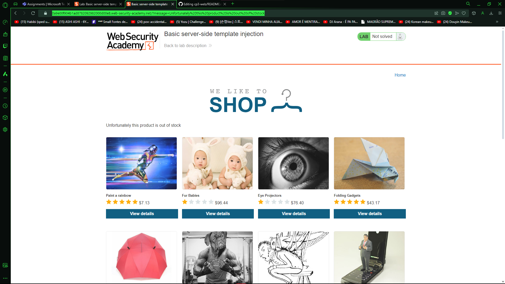
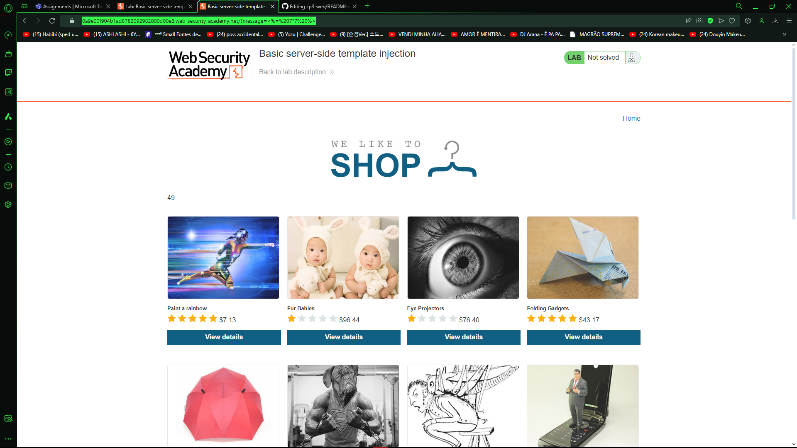
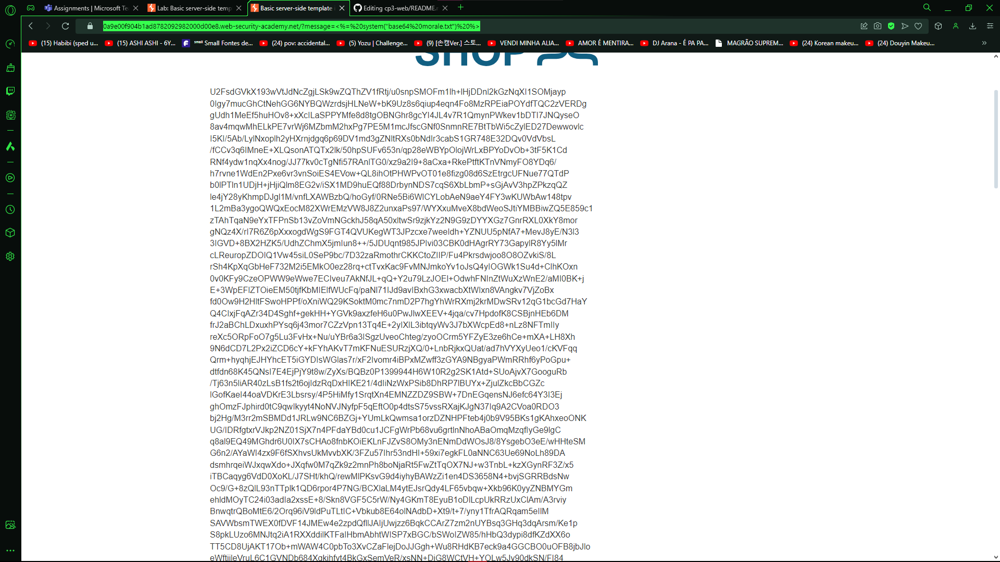
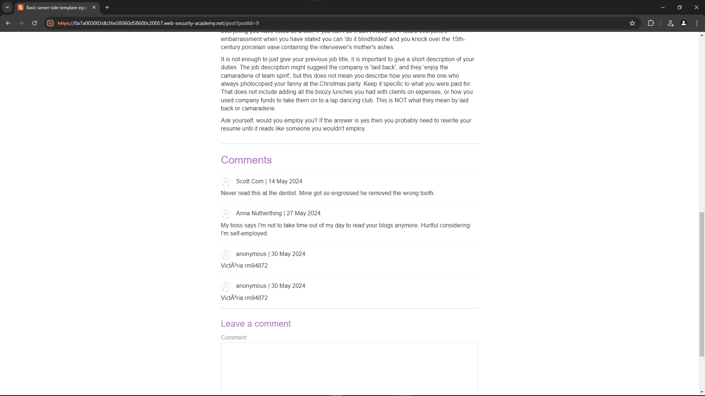
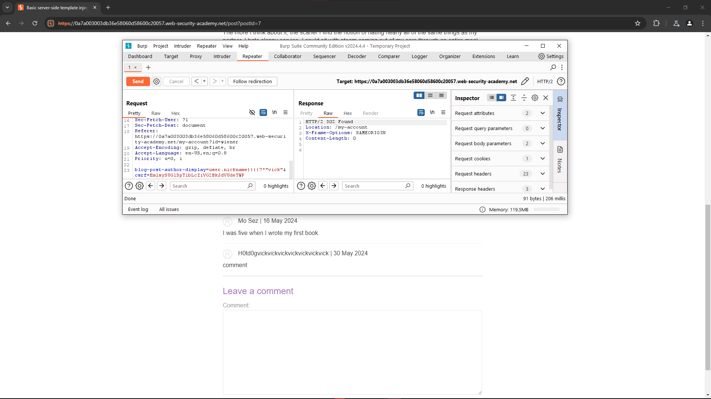
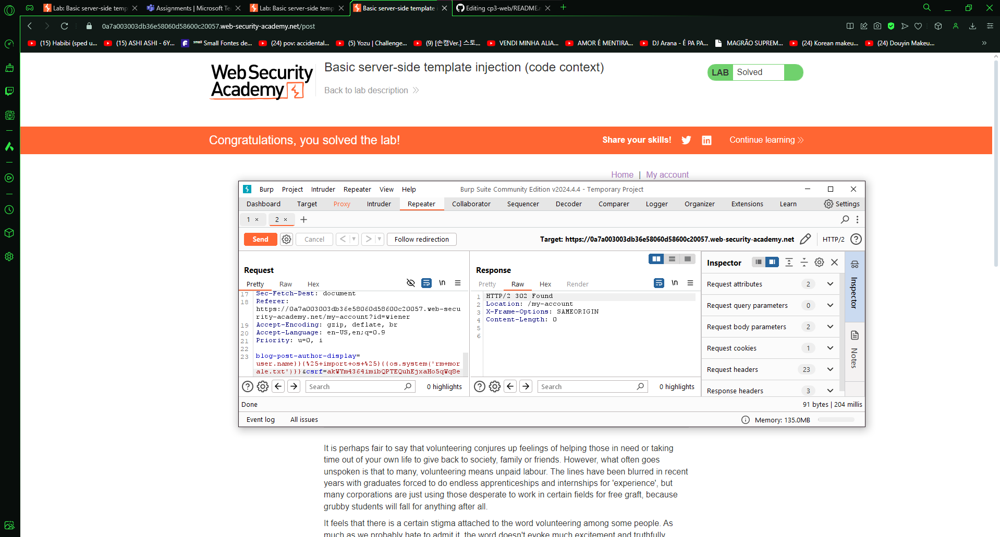

# CP3-WEB -- PortSwigger
  
### *Nome: Victória Oliveira Ventrilho*
### *RM: 94872*
  
  
---
  
### LAB 1
  
*1. Uma captura de tela completa (exibindo o endereço do seu laboratório) com a mensagem de erro produzida pela aplicação quando um item está esgotado no estoque.*
  
    *✯ Esse na verdade era bem facíl, eu apenas estava olhando o site e clicante em tudo o que via pela frente e acabei clicando na primeira imagem que era de $95.65 e me mostrou a mensagem de erro. Ou também pode ser feito por trás da url, quando você entra entra em um produto ele coloca na url um productID=value e pode modificar para 1 para tentar vizualizar mas não vai dar certo, isso vai redirecionar a gente para pagina principal com a mensagem de erro.*

  

---

*2. Uma captura de tela completa (exibindo o endereço do seu laboratório e seu payload) como prova de que você consegue realizar operações simples, tais como: somar ou multiplicar dois números ou multiplicar uma string (exemplo: 'FIAP' \* 10). Exiba o seu payload na barra de endereços.*
     
       ✯ *Para fazer o teste desse foi bem simples apesar de precisar dar uma pesquisada, eu tentei primeiramente mudar o payload de message para "Message={7\*7}" mas desse jeito não foi então eu reli o principio do exercicio e pesquisei sobre ERB template, e então descobri que é um templating language, baseado em Ruby e tinha alguns exeplos de como usá-lo. Foi o que fiz e usei o primeiro exemplo <%= EXPRESSION %> só mudei o expression por 7\*7 que me deu a resposta 49.*
   
  

---

*3. Envie um print mostrando qual o hash MD5 do arquivo morale.txt.*
  
       ✯ *Para fazer este eu pesquisei como rodar comandos do sistema em ruby que me levou a está página(https://www.rubyguides.com/2018/12/ruby-system/) lá eu vi que dizia como um exemplo system("ls") e então eu usei uma ferramenta que já conhecia chamada md5sum, após passar a ferramenta é só passar o nome do arquivo que ele vai checar e nos dar a hash md5(comando usado: `message=<%= system("md5sum morale.txt") %>`*

  

---

*4. Responda qual o tipo de arquivo é o morale.txt.*
  
       ✯ *Para este eu fiz do mesmo jeito que o último exercício feito, porém, usando a ferramenta file(comando usado: `message=<%= system("file morale.txt") %>`*
  

---

*5. Demonstre (através de comandos e explicando com suas próprias palavras) como você copiaria o arquivo morale.txt do servidor do lab. Também forneça prova de que este arquivo foi copiado na sua própria máquina demonstrando as saídas dos comandos `file`, `ls`, e `md5sum` no seu próprio terminal.*
  
       ✯ *Primeiramente eu tentei de várias formas, como abrir um servidor http com python, usando o scp, sftp, rsync e fazendo o download, porém não deram certo, então o único jeito que achei de fazer foi mandar o payload: `<%=system("base64 morale.txt")%>`, e então copiei o base64 do arquivo que foi dado, levei para o kali em uma máquina virtual, colei o base64 num arquivo de notas, removi os espaços em branco com o vim pelo comando `%s/ //g`, e depois de retirar os espaços em branco eu decodifiquei o arquivo com o comando `base64 -d arquivo.txt > decodificado.txt` e chequei os hashes md5 de cada arquivo, que eram iguais.*
  

---

*6. Forneça o payload utilizado para completar o primeiro laboratório e a evidência que você conseguiu completá-lo.*
  
       ✯ *O payload utilizado foi `<%=%20system("rm%20morale.txt")%20%>`*
  

---

*7. Em qual linguagem o sistema de template está sendo executado?*
  
       ✯ *Como a prória documentação do ERB template diz ele é uma linguagem de template baseada em Ruby.* 

  
### LAB 2
  
*1. Uma captura de tela completa (exibindo o endereço do seu laboratório) com um comentário anônimo contendo seu primeiro nome e RM.*
  
       ✯ *O primeiro é apenas fazer um comentário sem estar logado em alguma conta, dizendo seu nome e rm.*
  

---

*2. Uma captura de tela completa (exibindo o endereço do seu laboratório e seu payload) com prova de que você consegue realizar operações simples, tais como: somar ou multiplicar dois números ou multiplicar uma string.*
     
       ✯ *O payload utilizado foi `user.nickname}}{{7*"vick`*
  

---

*3. em qual linguagem o sistema de template está sendo executado?*
     
       ✯ *A documentção do tornado.template diz que: Um sistema de templates simples que compila templates para código Python. Então, é python.*
  

---

*4. forneça evidência de que conseguiu completar o objetivo deste laboratório.*
     
       ✯ *O payload utilizado foi `user.name}}{%25+import+os+%25}{{os.system('rm+morale.txt')}}`**
  

---
